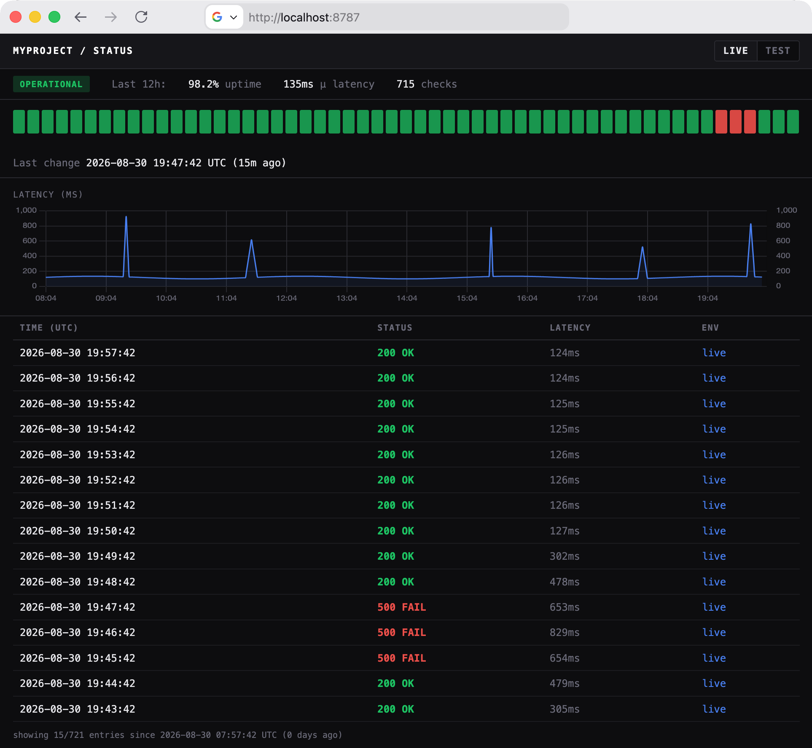

<!-- markdownlint-disable MD041 first-line-heading/first-line-h1 -->


[](https://www.typescriptlang.org/)
[](https://pnpm.io/)
[](https://vitest.dev/)
[](https://github.com/j178/prek)
[](https://github.com/biomejs/biome)
[](https://workers.cloudflare.com/)
[](https://opentofu.org/docs/)

A serverless uptime monitoring tool, for deployment on Cloudflare Workers.

Features:

- A simple web interface showing health over the last 12 hours
- Track multiple environments (test / live)
- Customisable cron expression: ping servers up to every minute
- Email alerts sent on state changes (down / recovered)
- An OpenTofu module to quickly deploy via IaC
- Geofence requests to the status page per country

<!-- markdownlint-disable MD033 no-inline-html -->
<p align="center">
    <!-- markdownlint-disable-next-line MD013 line-length -->
    
</p>
<!-- markdownlint-enable MD033 no-inline-html -->

## Prerequisites

- [pnpm](https://pnpm.io/) must be available locally.

## Quickstart

Run the worker locally using Wrangler via pnpm:

```sh
# only before first run, replace values in .env file as appropriate
cp src/.env.example src/.env

pnpm d1:local:init
pnpm d1:local:seed
pnpm dev
```

Navigate to `http://localhost:8787` to see UptimeWorker running locally.

Manually trigger the scheduled heartbeat by navigating to: `http://localhost:8787/__scheduled?cron=*+*+*+*+*`

## Deploy

UptimeWorker is ready to be deployed via OpenTofu / Terraform:

```hcl
module "uptime_monitor" {
  source = "git::https://github.com/albertomh/UptimeWorker.git?ref=v1.0.0"
  ...
```

See full details of the Infrastructure-as-Code setup in [OPENTOFU.md](./docs/OPENTOFU.md)

## Email alerts

UptimeWorker is configured to send emails via Mailtrap out of the box.

Extend `sendAlertEmail` and set the `ALERT_PROVIDER` environment variable accordingly to add
support for other providers.

## Develop

- [prek](https://prek.j178.dev/) must be available locally to run pre-commit hooks.

### Run tests

Run tests locally with:

```sh
pnpm test
pnpm tofu:test
```

These also run in CI for every branch and merge commit.

## Motivation

A number of uptime monitors already exist. However, I faced the following
issues with those that I tried:

- Price. Some hosted offerings have free tiers, but these are not very generous
  or check sites so infrequently as to be useless.
- Complexity. Both paid & open-source tools over-extend themselves and 1) try
  to do too much 2) have too many settings to fiddle with.
- Maintenance burden. Most of the host-it-yourself projects require standing up
  a whole server (and looking after it). I wanted something serverless I could
  deploy and forget about.

---

## Acknowledgements

Wordmark typeset in [Jacquard 24](https://fonts.google.com/specimen/Jacquard+24).
